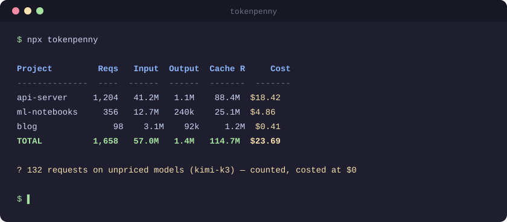

# 💰 tokenpenny

[](https://github.com/0718lol/tokenpenny/actions/workflows/ci.yml)
[](https://www.npmjs.com/package/tokenpenny)
[](./LICENSE)

**See where your AI coding agents' tokens and dollars actually go — one command, every agent, task-level attribution.**

**看清你的 AI 编程 Agent 把 token 和钱花在了哪里 —— 一条命令，全家桶，任务级归因。**

<p align="center">
  
</p>

> ccusage knows how much you spent on Claude Code. tokenpenny knows where it went — across every agent you use — and how to spend less.
>
> ccusage 知道你在 Claude Code 上花了多少；tokenpenny 知道这些钱花到了哪里、怎么省。

One command, zero config, 100% local: tokenpenny reads the session logs your coding agents already write to disk. No daemon, no API keys, nothing leaves your machine.

一条命令、零配置、纯本地：tokenpenny 直接解析编程 Agent 已经写在磁盘上的会话日志。没有后台进程，不需要 API key，数据不出你的电脑。

## Quick start

```bash
npx tokenpenny                              # last 30 days, grouped by project
npx tokenpenny report --since 7d --by model # this week, per model
npx tokenpenny report --by branch           # which branch burned the money
npx tokenpenny report --by pr               # roll it up per pull request
npx tokenpenny report --by branch -p api-server  # drill into one project
npx tokenpenny report --since all --by day  # everything, per day
npx tokenpenny sources                      # which agents were detected
```

Requires Node.js >= 20. Requires nothing else.

## Sample output

```text
Project         Reqs   Input  Output  Cache R     Cost
--------------  ----  ------  ------  -------  -------
api-server     1,204   41.2M   1.1M    88.4M  $18.42
ml-notebooks     356   12.7M   240k    25.1M   $4.86
blog               98    3.1M    92k     1.2M   $0.41
TOTAL          1,658   57.0M   1.4M   114.7M  $23.69

? 132 requests on unpriced models (kimi-k3) — counted, costed at $0
```

Note the last line: models tokenpenny has no verified price for are **flagged, never guessed**.（注意最后一行：没有可靠价格的模型会被明确标注，绝不瞎猜。）

## Supported agents

| Agent | Status |
|---|---|
| Claude Code | ✅ shipped |
| Codex (OpenAI) | ✅ shipped |
| DeepSeek Harness (DSH) | planned — PRs welcome |
| OpenCode | planned — PRs welcome |
| Gemini CLI | planned — PRs welcome |

## Roadmap — three pillars

1. **Every agent, one ledger.** One command sums up every coding agent on your machine. 一个命令算清全家所有 Agent 的账。
2. **Task-level attribution.** ✅ Fully shipped: `--by branch` (v0.2) answers *"which branch burned the money"*, and `--by pr` (v0.3) rolls costs up per pull request — PR numbers and titles are mapped from your local git merge commits, still 100% offline, no GitHub API. `-p <project>` drills into one repo. 钱花在哪个分支、哪个 PR 上，一目了然。
3. **Spend less.** Budget alerts and actionable suggestions: which calls could run on a cheaper model. 预算告警 + 可执行的省钱建议。

## Design principles

- **Local-only.** Parse files on disk; never call home. 纯本地，绝不上传。
- **Zero config.** Autodetect every agent's data directory. 自动发现一切。
- **Honest numbers.** Unpriced models are labeled, not estimated. 不确定的价格不猜。

Known limitation: `--by pr` maps branches to PRs from GitHub-style merge commits in your local git history. Squash-merged PRs don't record the branch name, so those can't be tied back offline — those branches show up as `(no PR) <branch>`.（已知限制：squash 合并的 PR 不含分支名，无法离线关联，对应分支会显示为 `(no PR) <branch>`。）

## Add an agent (great first issue)

Implement one interface and register it — that's the whole adapter:

```ts
// src/sources/<your-agent>.ts
import type { AgentSource } from './index.js';

export const myAgent: AgentSource = {
  id: 'my-agent',
  name: 'My Agent',
  dataDir: () => '/path/to/session/logs',
  isDetected: async () => fs.access('/path/to/session/logs').then(() => true, () => false),
  collectEvents: async () => {
    // read the log files, yield normalized UsageEvent[]
    return [];
  },
};
```

Push it into `SOURCES` in `src/sources/index.ts`, add fixture lines + a test, open a PR. Normalizing to `UsageEvent` is all that matters — aggregation, pricing, and rendering are shared.

## Development

```bash
npm install
npm test                        # type check + unit tests
npm run dev -- report --since 7d --by model
```

## 中文说明

**tokenpenny** 是一个本地优先的 AI 编程 Agent 用量/成本统计 CLI：

- **为什么**：编程 Agent 的会话日志本来就写在本地磁盘上，却没有一个工具能跨 Agent 把这些账算清楚——ccusage 只管 Claude Code，各家实时监控也各管各的。
- **怎么用**：`npx tokenpenny` 一条命令，按项目/天/模型/会话聚合 token 和成本。
- **三大支柱**：① 全家桶适配（Claude Code / Codex / DSH / OpenCode / Gemini CLI）；② 任务级归因（✅ v0.2 按分支 `--by branch`，✅ v0.3 按 PR `--by pr`，PR 号从本地 git 合并提交中离线解析，`-p` 下钻单项目）；③ 省钱闭环（预算告警 + 换便宜模型的建议）。
- **隐私**：纯本地解析，不需要 API key，没有任何网络请求。

欢迎通过 PR 接入新 Agent——实现 `AgentSource` 接口即可，见上文示例。

## License

MIT
